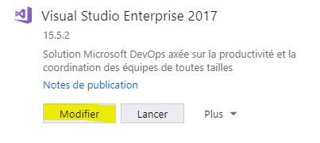
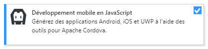

# lesgermes_ionic2

Project made with Ionic and Cordova

### Get started coding

- Install [Visual Studio 2017](https://www.visualstudio.com/downloads/)
- From Visual Studio Installer, install JavaScript Mobile Development tools
  - 
  - 
- Then you will need to install [NPM Task Runner extension](https://aka.ms/ctmhio)
- You should now be good to go =)
